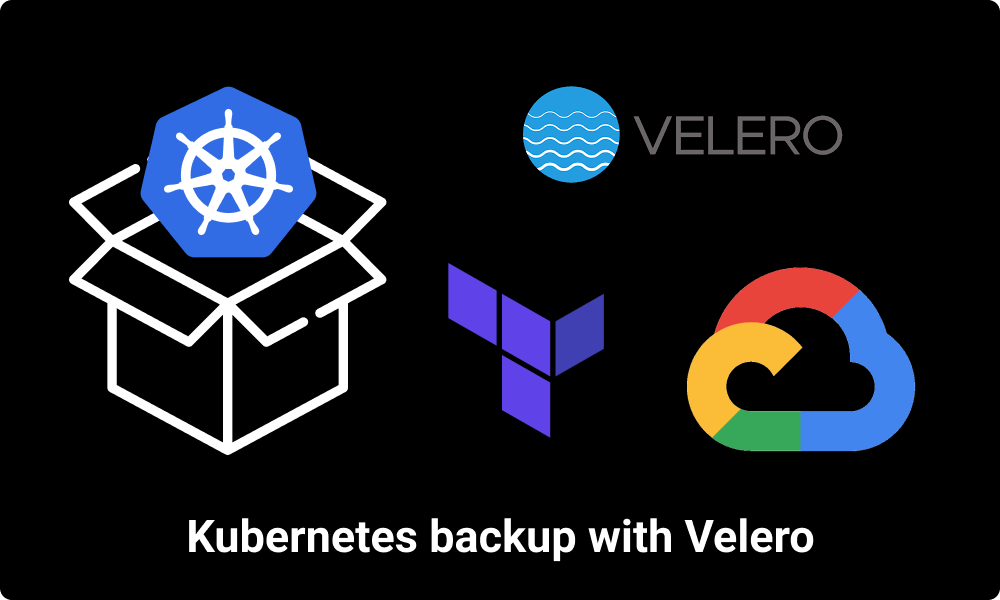

# velero
Backing-up, restoring and migrating kubernetes cluster with velero📦 .



## starting a docker conatiner with terraform installed
```bash
docker run -it --rm -v ${PWD}/storage:/storage -w /storage akshit8/terraform 

chmod +x .terraform/providers/registry.terraform.io/hashicorp/google/3.54.0/linux_amd64/terraform-provider-google_v3.54.0_x5
```

## setting up a test cluster with kind
```bash
kind create cluster --name test-cluster --image kindest/node:v1.18.0

docker run -it --rm -v ${HOME}:/root/ -v ${PWD}:/work -w /work --net host debian:buster

apt-get update && apt install curl vim -y

curl -LO https://storage.googleapis.com/kubernetes-release/release/`curl -s https://storage.googleapis.com/kubernetes-release/release/stable.txt`/bin/linux/amd64/kubectl

chmod +x ./kubectl

mv ./kubectl /usr/local/bin/kubectl

root@my-vm:/work# kubectl get nodes
NAME                         STATUS   ROLES    AGE     VERSION
test-cluster-control-plane   Ready    master   5m15s   v1.17.0

curl -L -o /tmp/velero.tar.gz https://github.com/vmware-tanzu/velero/releases/download/v1.5.1/velero-v1.5.1-linux-amd64.tar.gz

tar -C /tmp -xvf /tmp/velero.tar.gz

mv /tmp/velero-v1.5.1-linux-amd64/velero /usr/local/bin/velero

chmod +x /usr/local/bin/velero

velero --help

kubectl create ns sample

kubectl -n sample apply -f ./k8s-objects

export BUCKET=velero-akshit
export REGION=asia-east1

velero install \
    --provider gcp \
    --plugins velero/velero-plugin-for-gcp:v1.1.0 \
    --bucket $BUCKET \
    --secret-file ./gcpServiceAccount/credentials.json

root@my-vm:/work# kubectl -n velero get pods
NAME                      READY   STATUS    RESTARTS   AGE
velero-86bb45cdfb-987ps   1/1     Running   0          23s

kubectl logs deployment/velero -n velero

velero backup create sample-namespace-backup --include-namespaces sample

velero backup describe sample-namespace-backup

velero backup logs sample-namespace-backup

root@my-vm:/work/velero# velero get backups
NAME                      STATUS      ERRORS   WARNINGS   CREATED                         EXPIRES   STORAGE LOCATION   SELECTOR
sample-namespace-backup   Completed   0        0          2021-02-24 07:44:11 +0000 UTC   29d       default            <none>

kubectl -n sample delete -f ./k8s-objects

root@my-vm:/work/velero# kubectl get all -n sample
No resources found in sample namespace.

velero restore create sample-namespace-backup --from-backup sample-namespace-backup

velero restore describe sample-namespace-backup

root@my-vm:/work/velero# kubectl get all -n sample
NAME                             READY   STATUS    RESTARTS   AGE
pod/sample-app-6ffc75c46-g6bbg   1/1     Running   0          24s
pod/sample-app-6ffc75c46-nsg8d   1/1     Running   0          24s

NAME                     TYPE        CLUSTER-IP      EXTERNAL-IP   PORT(S)    AGE
service/sample-service   ClusterIP   10.104.123.76   <none>        3000/TCP   24s

NAME                         READY   UP-TO-DATE   AVAILABLE   AGE
deployment.apps/sample-app   2/2     2            2           24s

NAME                                   DESIRED   CURRENT   READY   AGE
replicaset.apps/sample-app-6ffc75c46   2         2         2       24s

kind create cluster --name test-cluster-2 --image kindest/node:v1.19.0

## repeat steps

root@my-vm:/work# kubectl get nodes
NAME                           STATUS   ROLES    AGE    VERSION
test-cluster-2-control-plane   Ready    master   6m1s   v1.19.0

kubectl logs deployment/velero -n velero
[NO errors]

root@my-vm:/work/velero# velero get backup
NAME                      STATUS      ERRORS   WARNINGS   CREATED                         EXPIRES   STORAGE LOCATION   SELECTOR
sample-namespace-backup   Completed   0        0          2021-02-24 07:44:11 +0000 UTC   29d       default            <none>

root@my-vm:/work/velero# kubectl get ns
NAME                 STATUS   AGE
default              Active   11m
kube-node-lease      Active   11m
kube-public          Active   11m
kube-system          Active   11m
local-path-storage   Active   10m
velero               Active   2m45s

velero restore create sample-namespace-backup --from-backup sample-namespace-backup

velero restore describe sample-namespace-backu

Phase:  Completed

Started:    2021-02-24 09:52:47 +0000 UTC
Completed:  2021-02-24 09:52:48 +0000 UTC

 kubectl get all -n sample
```
