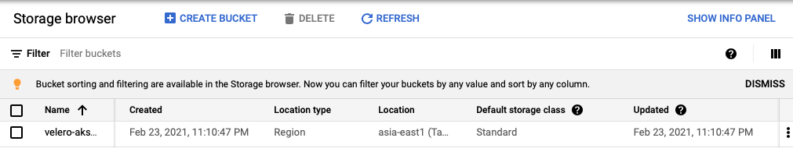
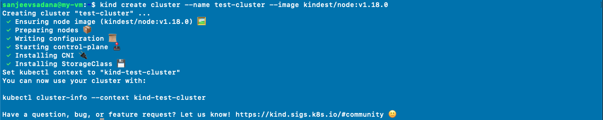
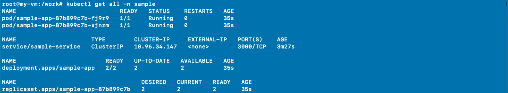
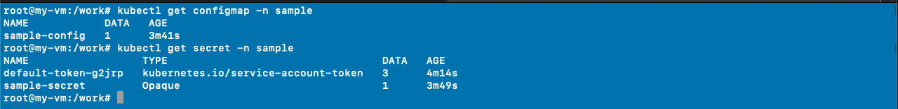
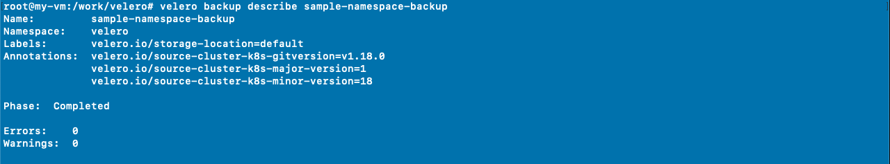
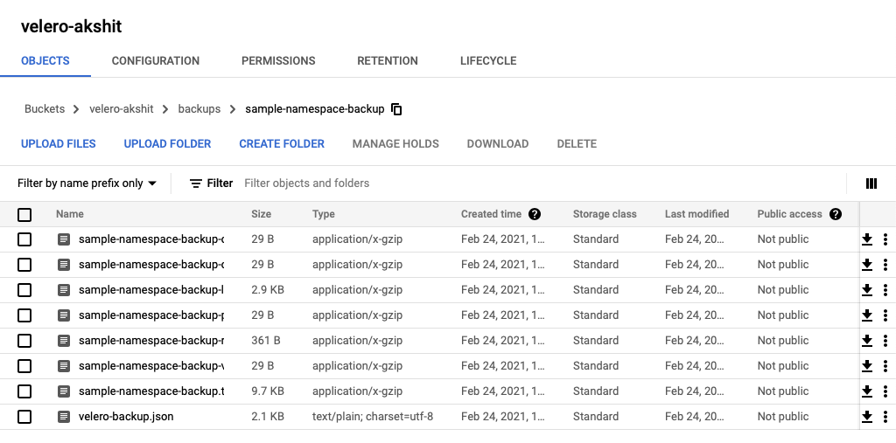
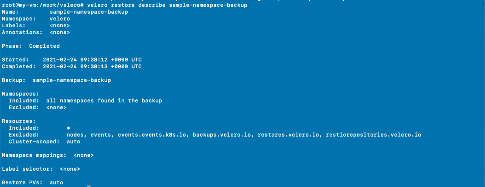

# velero
Backing-up, restoring and migrating kubernetes cluster with velero📦 .


Velero is a light weight tool to safely backup, restore, handle cluster-failovers, and migrate Kubernetes cluster resources and persistent volumes.

## Kubernetes cluster with Kind
[Kind](https://kind.sigs.k8s.io/) is a light weight utility to create single-node Kubernetes cluster on a docker container for testing purposes. Using kind will allow us to create two test cluster of different versions quickly, thus allowing us to simulate cluster-migrations.<br>
For installing kind:
- checkout [kind-quickstart](https://kind.sigs.k8s.io/docs/user/quick-start/)
- Or watch [this](https://www.youtube.com/watch?v=m-IlbCgSzkc) video

**CAUTION** 🛑 🛑 :
- Make sure Docker is installed on your machine/
- If you are using kubernetes(v 1.17), do check your coredns is working. For verifying status of coredns click [here](https://stackoverflow.com/questions/53075796/coredns-pods-have-crashloopbackoff-or-error-state).

## Service account for terraform and velero
Instructions for creating a service account with necessary permission [here](../gcpServiceAccount/README.md).

## Setting up storage plugin for velero
Velero requires a storage site for pushing back-up files and retrieving them back in case of restoration. We'll be using Google cloud storage bucket for this tutorial, but you can explore wide variety of storage plugin offered by velero [here](https://velero.io/plugins/).

### Creating a storage bucket with terraform
You can grap terraform CLI from [here](https://www.terraform.io/downloads.html) or else use docker container that comes pre-installed with terraform. The infrastructure files for terraform are placed inside [storage](./storage) folder. Make sure your `credentials.json` is present inside `gcpServiceAccount` folder

```bash
docker run -it --rm -v ${PWD}/storage:/storage -w /storage akshit8/terraform 
```

Once the container has been created run the following commands to create a storage bucket on GCP

```bash
# to download gcp provider and any dependency
terraform init

# to apply changes on the cloud
terraform apply
```

If no error is thrown you'll be able to see newly created bucket in your cloud console.



## Test cluster(v 1.18)
With storage bucket in place, let us create a test cluster with kubernetes version 1.18

```bash
kind create cluster --name test-cluster --image kindest/node:v1.18.0
```



## Installing Kubectl and Velero CLI
To install both CLI's i'll use a debian docker container

```bash
docker run -it --rm -v ${HOME}:/root/ -v ${PWD}:/work -w /work --net host debian:buster
```
mounting $HOME directory provides access to KUBE_CONFIG generated by kind.

- Installing Kubectl
```bash
curl -LO https://storage.googleapis.com/kubernetes-release/release/`curl -s https://storage.googleapis.com/kubernetes-release/release/stable.txt`/bin/linux/amd64/kubectl

chmod +x ./kubectl

mv ./kubectl /usr/local/bin/kubectl
```

To verify kubectl and our test cluster run

```bash
root@my-vm:/work# kubectl get nodes
NAME                         STATUS   ROLES    AGE     VERSION
test-cluster-control-plane   Ready    master   5m15s   v1.18.0
```

- Installing velero CLI

```bash
curl -L -o /tmp/velero.tar.gz https://github.com/vmware-tanzu/velero/releases/download/v1.5.1/velero-v1.5.1-linux-amd64.tar.gz

tar -C /tmp -xvf /tmp/velero.tar.gz

mv /tmp/velero-v1.5.1-linux-amd64/velero /usr/local/bin/velero

chmod +x /usr/local/bin/velero
```

## Deploying Kubernetes objects in a sample namespace
Kubernetes object that I use for this tutorial is located in [k8s-objects](./k8s-objects) folder.

```bash
kubectl create ns sample

kubectl -n sample apply -f ./k8s-objects
```





## Configuring Velero for backing-up sample namespace

- Using Velero CLI that we installed previously, we need to deploy some components(that velero use) inside our cluster and configure them, so that velero can access our cloud storage bucket

```bash
# setting the bucket name
export BUCKET=velero-akshit

# installing velero with provider gcp
velero install \
    --provider gcp \
    --plugins velero/velero-plugin-for-gcp:v1.1.0 \
    --bucket $BUCKET \
    --secret-file ./gcpServiceAccount/credentials.json
```

To verify above installation run following commands

```bash
root@my-vm:/work# kubectl -n velero get pods
NAME                      READY   STATUS    RESTARTS   AGE
velero-86bb45cdfb-987ps   1/1     Running   0          23s

kubectl logs deployment/velero -n velero
```

If installation and connection to our storage bucket is successful no error messages would be there inside deployment logs.

## Backing-up the sample namespace
For adding sample namespace to velero backup pool
```bash
velero backup create sample-namespace-backup --include-namespaces sample

velero backup describe sample-namespace-backup
```



If some error occurs inspect the backup logs

```bash
velero backup logs sample-namespace-backup
```

Listing backups

```bash
root@my-vm:/work/velero# velero get backups
NAME                      STATUS      ERRORS   WARNINGS   CREATED                         EXPIRES   STORAGE LOCATION   SELECTOR
sample-namespace-backup   Completed   0        0          2021-02-24 07:44:11 +0000 UTC   29d       default            <none>
```

Verify on Google Cloud Console



Our bucket contain backup files of all kuberntes objects that were deployed inside sample namespace.

## Deleting object inside sample namespace
```bash
kubectl -n sample delete -f ./k8s-objects
```

Let's now recover the deleted objects with Velero

```bash
velero restore create sample-namespace-backup --from-backup sample-namespace-backup
```



In case of any refer the logs

```bash
velero backup logs sample-namespace-backup
```

Let's verify whether sample namespace has restored or not

```bash
root@my-vm:/work/velero# kubectl get all -n sample
NAME                             READY   STATUS    RESTARTS   AGE
pod/sample-app-6ffc75c46-g6bbg   1/1     Running   0          24s
pod/sample-app-6ffc75c46-nsg8d   1/1     Running   0          24s

NAME                     TYPE        CLUSTER-IP      EXTERNAL-IP   PORT(S)    AGE
service/sample-service   ClusterIP   10.104.123.76   <none>        3000/TCP   24s

NAME                         READY   UP-TO-DATE   AVAILABLE   AGE
deployment.apps/sample-app   2/2     2            2           24s

NAME                                   DESIRED   CURRENT   READY   AGE
replicaset.apps/sample-app-6ffc75c46   2         2         2       24s
```

## Migrating cluster from version 1.18 to 1.19
As before we'll use kind to spin another light weight cluster with version 1.19

```bash
kind create cluster --name test-cluster-2 --image kindest/node:v1.19.0
```

Check if the cluster is ready and accessible

```bash
root@my-vm:/work# kubectl get nodes
NAME                           STATUS   ROLES    AGE    VERSION
test-cluster-2-control-plane   Ready    master   6m1s   v1.19.0
```

### Installing velero inside new cluster
- repeat the above steps to install velero again
- make sure deployment logs displays no error
- verify all components inside namespace velero are running.

## Migrating backup to new cluster
List the backups present inside storage bucket

```bash
root@my-vm:/work/velero# velero get backup
NAME                      STATUS      ERRORS   WARNINGS   CREATED                         EXPIRES   STORAGE LOCATION   SELECTOR
sample-namespace-backup   Completed   0        0          2021-02-24 07:44:11 +0000 UTC   29d       default            <none>
```

Starting the restore

```bash
velero restore create sample-namespace-backup --from-backup sample-namespace-backup
```
Verifying the restore

```bash
velero restore describe sample-namespace-backu

Phase:  Completed

Started:    2021-02-24 09:52:47 +0000 UTC
Completed:  2021-02-24 09:52:48 +0000 UTC
```

Checking if all the components has been recovered

```bash
kubectl get all -n sample
```


## Author
**Akshit Sadana <akshitsadana@gmail.com>**

- Github: [@Akshit8](https://github.com/Akshit8)
- LinkedIn: [@akshitsadana](https://www.linkedin.com/in/akshit-sadana-b051ab121/)

## License
Licensed under the MIT License